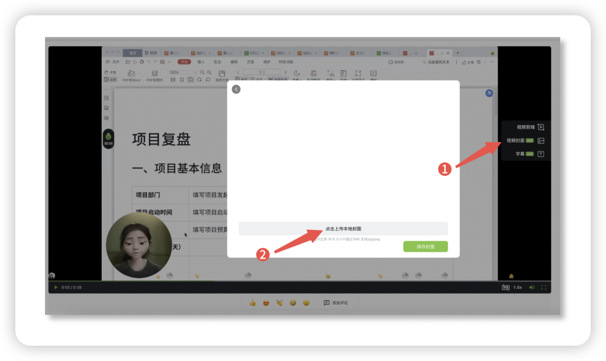

# 添加视频封面

## 添加方式 

添加封面需要在电脑端操作，你可以参考以下具体步骤

1. 打开电脑上的 「[芦笋录屏云空间](https://lusun.com/dashboard/videos)」，打开需要添加封面的视频
2. 点击视频右侧的「封面」功能
3. 上传本地 .jpg 或者.jpeg 格式的图片作为视频封面

<figure><figcaption>
添加视频封面
</figcaption></figure>

## 常见问题 

Q1：移动端能给视频添加封面吗？\
A1：暂不支持，敬请期待

Q2：下载后的视频带封面吗？\
A2：仅在线分享的视频带封面，下载后的视频不带封面

***

推荐更多教程供你参考：[电脑端攻略](../basic/pc.md)｜[手机端攻略](../basic/phone.md)｜[会员特权](../basic/vip.md)｜[进阶教程](./)｜[联系我们](../contact.md)
