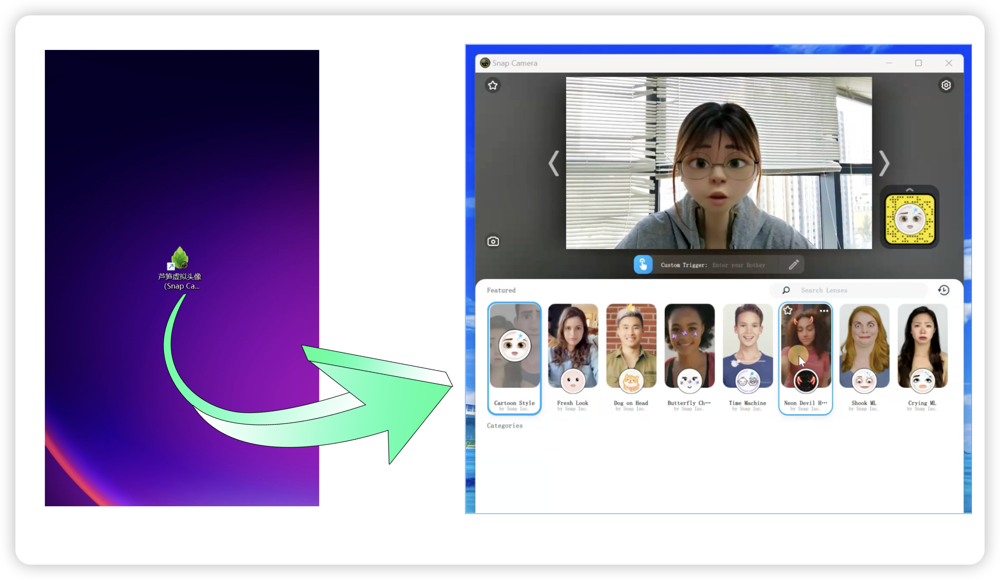
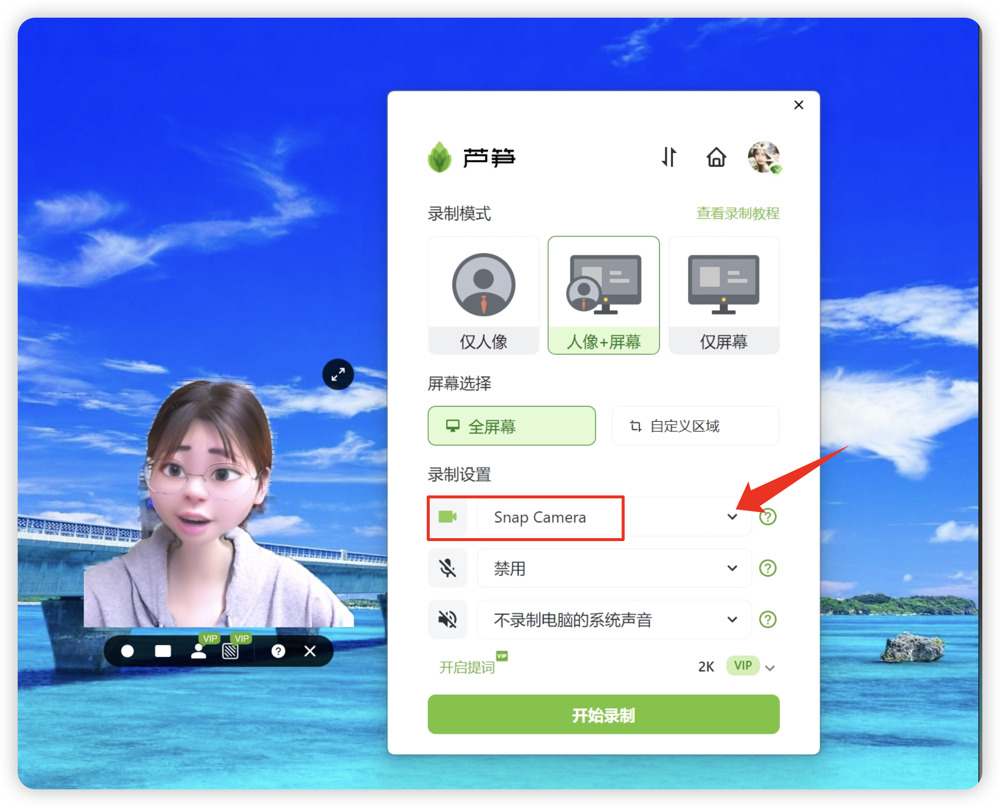

# 虚拟头像使用教程

如果你想实现虚拟人像录制，可以试试芦笋虚拟头像 (snap camera)，下面分别提供了下载链接、效果演示以及图文教程

## 如何下载

你可以点击以下链接，下载对应应用

* 芦笋虚拟头像 (snap camera)：请点击👉 [下载](https://lusun-snap-camera.oss-cn-beijing.aliyuncs.com/releases/v1.0.1/LuSun-SnapCamera-Helper-v1.0.1.exe)。注意：仅支持 Windows
* 芦笋录屏：请官网点击 👉 [下载](https://lusun.com/download)

## 效果演示

芦笋虚拟头像(snap camera)教程 链接：https://lusun.com/v/kfaeUTjfj4s

## 图文教程

第一步：下载芦笋虚拟头像 (snap camera)，点击👉[这里下载](https://lusun-snap-camera.oss-cn-beijing.aliyuncs.com/releases/v1.0.1/LuSun-SnapCamera-Helper-v1.0.1.exe)


注意：当前仅支持 Windows 电脑


第二步：打开芦笋虚拟头像 (snap camera)，选择自己喜爱的卡通人像

<figure><figcaption>
芦笋虚拟头像效果图
</figcaption></figure>

第三步：打开芦笋录屏，选择「人像+屏幕」模式，即可开启虚拟人像录制

<figure><figcaption>
芦笋录屏+芦笋虚拟摄像头
</figcaption></figure>

***

推荐更多教程供你参考：[电脑端攻略](../basic/pc.md)｜[手机端攻略](../basic/phone.md)｜[会员特权](../basic/vip.md)｜[进阶教程](./)｜[联系我们](../contact.md)
