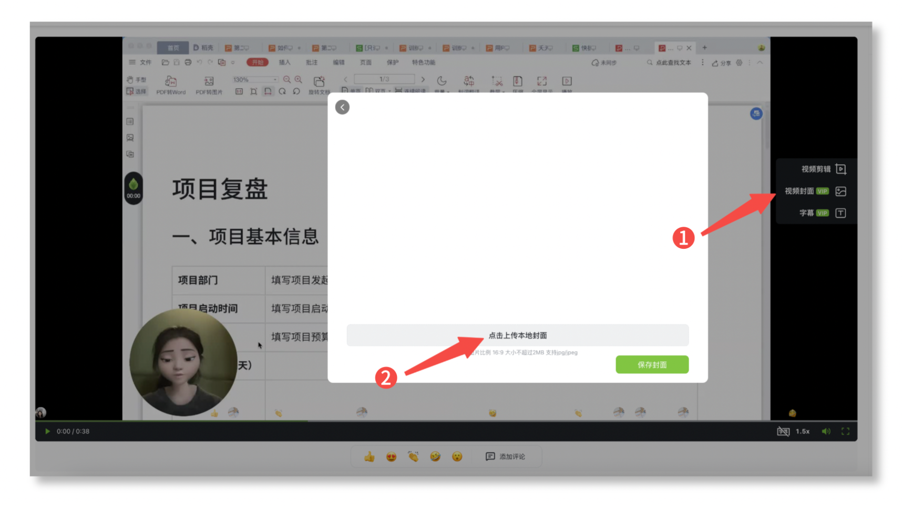

# 添加视频封面

### 👍 添加方式 

1. 你可以打开电脑上的 「[芦笋云空间](https://lusun.com/dashboard/videos)」，找到需要添加封面的视频
2. 点击视频右侧的 「封面」 功能
3. 上传本地 .jpg 或者.jpeg 格式的图片作为视频封面

<figure><figcaption>
芦笋录屏添加视频封面示意图
</figcaption></figure>

### 👀常见问题 

Q1：移动端能给视频添加封面吗？\
A1：暂不支持，敬请期待

Q2：下载后的视频带封面吗？\
A2：仅在线分享的视频带封面，下载后的视频不带封面

***

推荐阅读：[芦笋录屏欢迎你](../)｜[基础教程](../basic/)｜[进阶教程](./)
