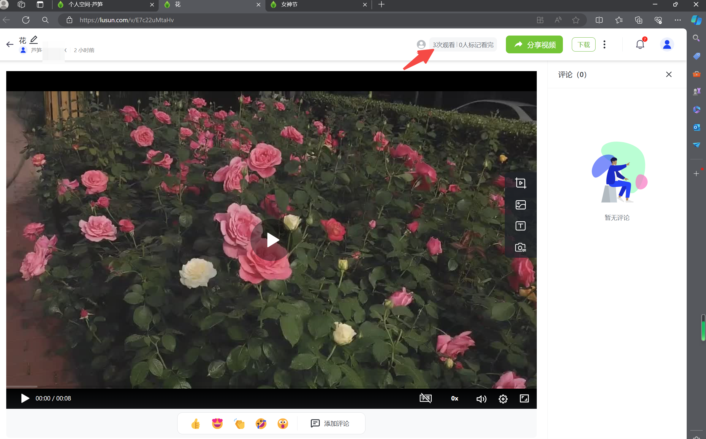
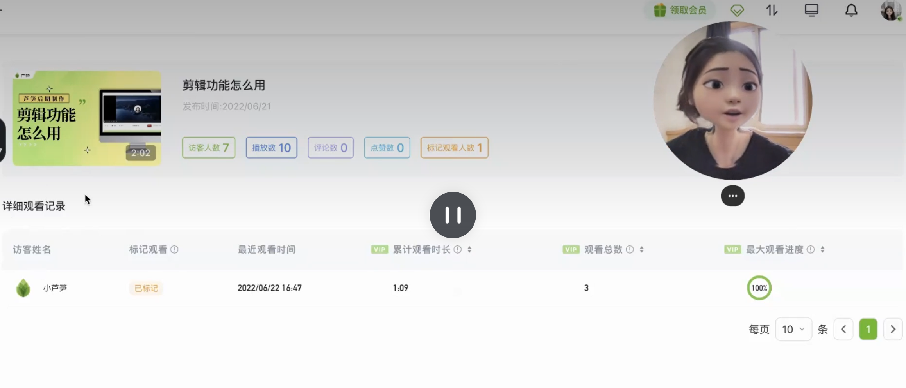

# 高级报表

## 视频教程

高级数据报表 链接: https://lusun.com/v/KMBAXKO2YET

## 图文教程

桌面端：[芦笋云空间](https://lusun.com/dashboard/videos/?ref=help.lusun.com) - 任意视频的播放页面 - 视频的右上角为「高级报表」入口

<figure><figcaption></figcaption></figure>

&#x20;移动端： 芦笋 App - 空间 - 任意视频的播放页面 - 视频下方可查看访客次数和观看次数以及标记观看次数

<figure><figcaption></figcaption></figure>

## 高级报表数据包含 

电脑端：

单视频维度：观看人数、次数、点赞评论数、标记「已观看」人数

针对单个观看者维度：最近观看时间、观看次数、总观看时长、进度等

<figure><figcaption></figcaption></figure>

移动端：

单视频维度：访客数、播放数、评论数、点赞数、标记观看

针对单个观看者维度：最近观看时间、观看次数、总观看时长、进度等

<figure><figcaption></figcaption></figure>

## 常见问题 

支持数据导出吗？\
答：暂不支持，敬请期待
