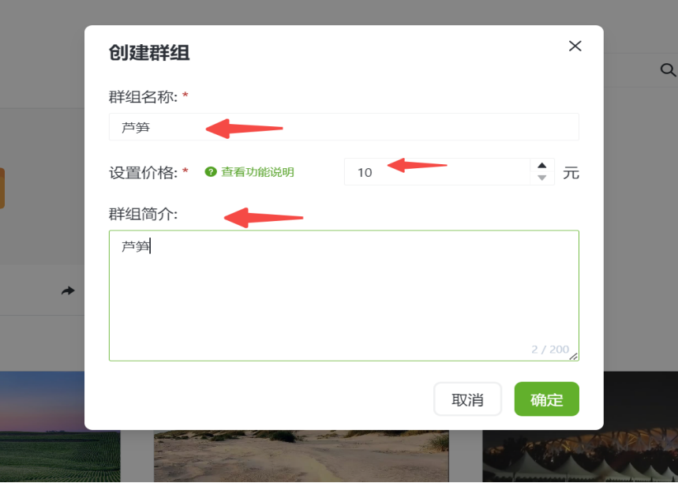
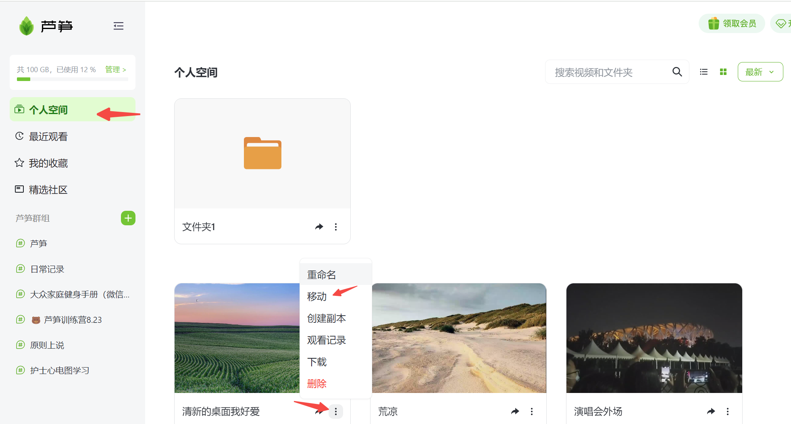
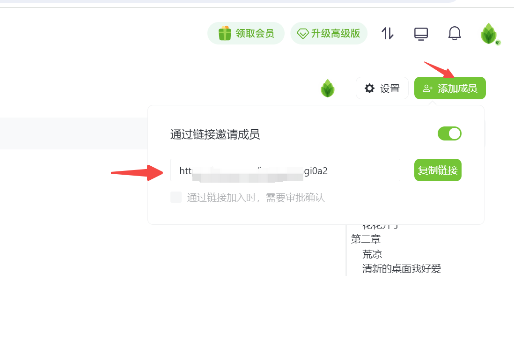
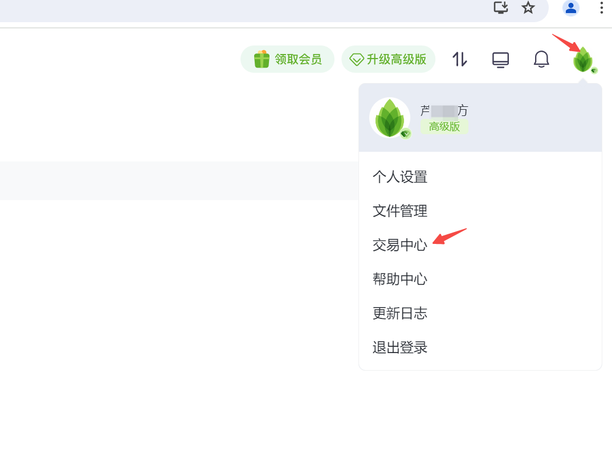
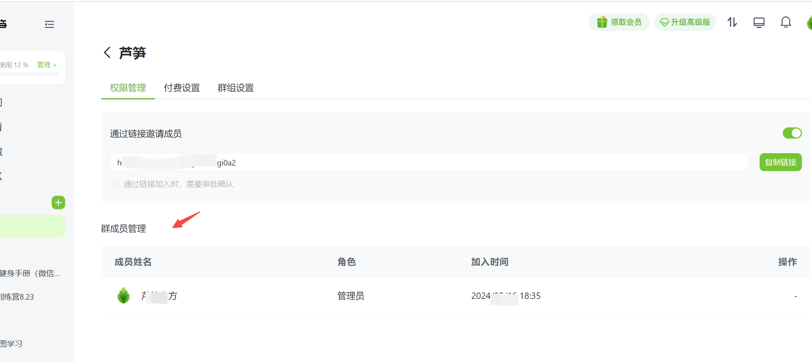

# 芦笋群组

## 视频教程

　芦笋群组使用教程链接：https://lusun.com/v/146sZjFJctN

## 文字教程 

### &#x20;  群组的增：

&#x20;  １、创建「芦笋群组」：

&#x20;     （１）你可以通过访问 「[芦笋录屏云空间](https://lusun.com/dashboard/videos)」，点击 「芦笋群组」 - 加号

&#x20;     &#x20;

<figure><figcaption></figcaption></figure>

&#x20;     （２）输入「群组名称」、「群组简介」、「设置价格」后完成创建

&#x20;           &#x20;

<figure><figcaption></figcaption></figure>

&#x20;2、添加视频：

&#x20; 共有两种：

&#x20; 第一种方式，是点击群组下方的「上传视频」按钮，可以将电脑本地的视频上传到群组空间内，

<mark style="color:red;">注意：免费版文件的大小不能超过２００Ｍ，高级版会员文件大小不能超过２Ｇ</mark>

&#x20;      &#x20;

<figure><figcaption></figcaption></figure>

&#x20; 第二种方式，是将个人空间内的视频移动到群组内，如点击３个点，点击移动，选择「芦笋群组」

&#x20;  &#x20;

<figure><figcaption></figcaption></figure>

### 群组的改：

１、分类管理：

&#x20;       点击群组下方的「新建目录」创建，如：第一章，回车，这个时候我们可以把上方的视频拖拽到第一章下方

&#x20; &#x20;

<figure><figcaption></figcaption></figure>

&#x20;       可以建第二章，在同一章视频内也可以拖拽，调整这两个视频的顺序，有多个视频也可以拖拽调整顺序，我们可以在右侧看到视频的目录，这个名字我们也可以自己编辑。

<figure><figcaption></figcaption></figure>

２、成员管理

&#x20;       在群组的右上角点击「添加成员」，在这里可以复制我们的群组邀请链接，被邀请的用户点击链接后付相应的金额就可以加入到群组

<figure><figcaption></figcaption></figure>

3、群组的收入提现入口，点击右上角的头像，点击「交易中心」就可以进入到提现的入口，就可以将群组付费的钱提取到自己的账户上

<figure><figcaption></figcaption></figure>

### 群组的删

１、可以在「设置」中的「权限管理」页面将其他的成员移除群组

<figure><figcaption></figcaption></figure>

2、解散群组可以在右上角的「设置」中「群组设置」页面点击「解散群组」即可

<figure><figcaption></figcaption></figure>

## 关于权限

### &#x20;　　１、管理员的权限

　　　（１）增删群组内视频，设置每个视频的分享权限

　　　（２）邀请 / 移出群组成员

### 　　**２、**群组成员的权限

　　　（１）查看群组中视频内容，默认无法下载、分享视频

　　　（２）通过「芦笋录屏」公众号实时查收群组内容更新提示

## 常见场景 

　　　（１）培训机构邀请学员进入群组，防止视频内容过度传播

　　　（２）团队成员进入团队知识库群组，共享视频内容

　　　（３）运营同学邀请用户进入功能更新群组，第一时间通知新功能视频教程

　　　（４）项目经理邀请协作方进入项目进度群组，通过视频方了解项目进度
