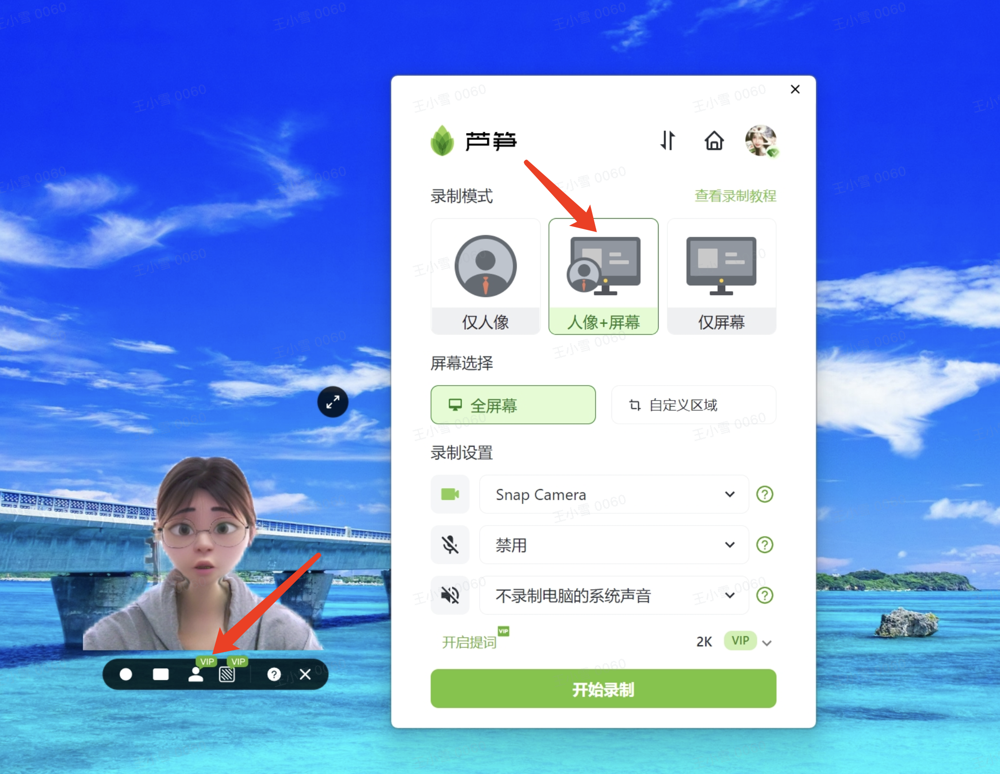
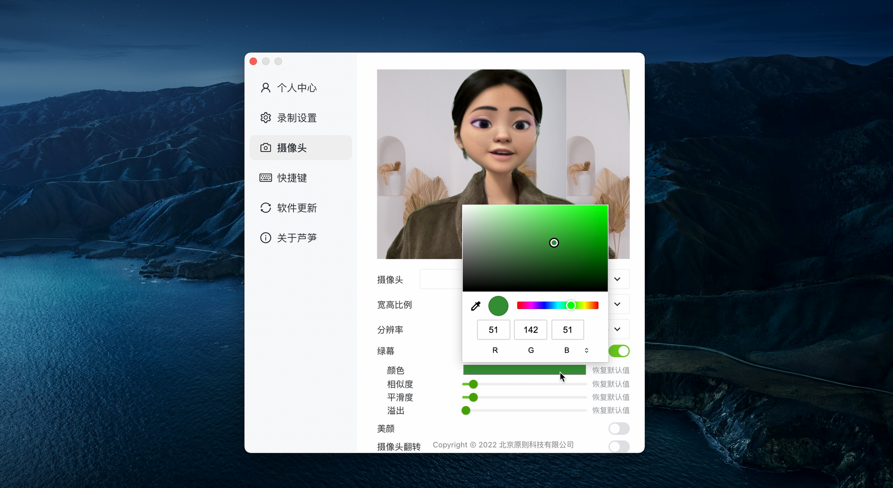
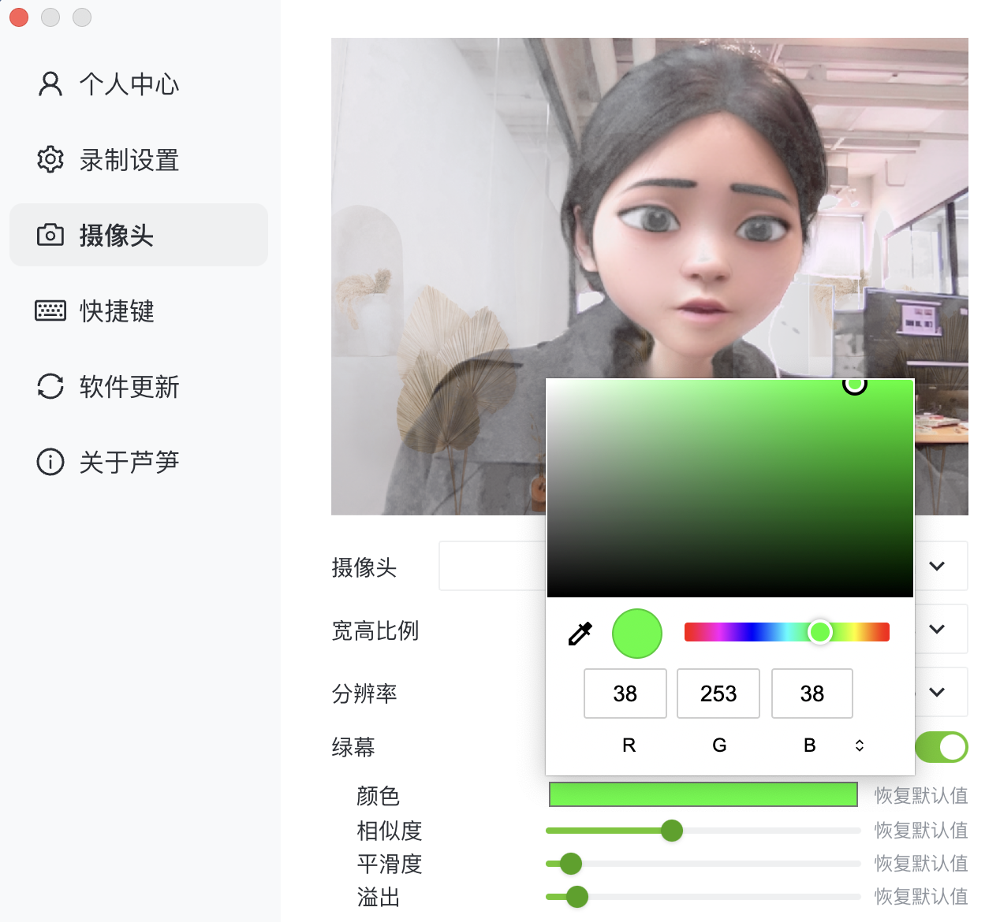

# 两种人像抠图方式

## 视频教程

芦笋录屏绿幕抠像功能 链接: https://lusun.com/v/Ikd1Rw6476i

## 图文教程 

### 👉白墙抠像法 

1. 打开芦笋客户端，选择 「人像+屏幕」 方式
2. 鼠标放到人像上，点击 「抠图人像」 即可
3. 打开要讲解的 PPT 等页面，人像自动出现在页面上，即可 「开始录制」

<figure><figcaption>
芦笋录屏一键抠人像
</figcaption></figure>

### 👉绿幕抠像法 

1. 打开客户端，点击头像 - 设置 - 摄像头设置
2. 打开绿幕功能即可一键扣除背景
3. 调整颜色、相似度等参数，实现较好的抠图效果后即可 「开始录制」

<figure><figcaption>
芦笋绿幕抠像
</figcaption></figure>

## 👀常见问题 

Q1：使用真实背景时可以出现人像，选择抠像时人像是灰色的，一直转圈\
A1：常见于 win10 以下的系统设备，需要下载驱动大师更新摄像头驱动后，再使用抠像功能

<figure><figcaption></figcaption></figure>

Q2：点击白墙抠像法的「抠图人像」没有反应\
A2：「绿幕抠像」 模式打开时，没有办法使用 「白墙抠像」，先打开头像 - 设置 - 摄像头设置 - 关闭绿幕抠像，然后再尝试抠图人像功能

Q3: 使用「绿幕抠像」法，打开绿布功能后，人像和背景都非常模糊\
A3：「绿幕抠像」法需要在绿幕前录制，准备好绿布再打开该功能，没有绿布的情况下人像和背景都是模糊的

<figure><figcaption>
人和背景模糊的状态
</figcaption></figure>

芦笋录屏官网：请访问 [lusun.com](https://lusun.com)

***

推荐阅读：[芦笋录屏欢迎你](../)｜[基础教程](../basic/)｜[进阶教程](./)
