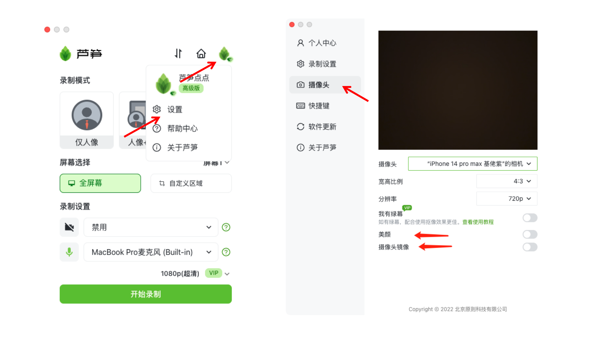
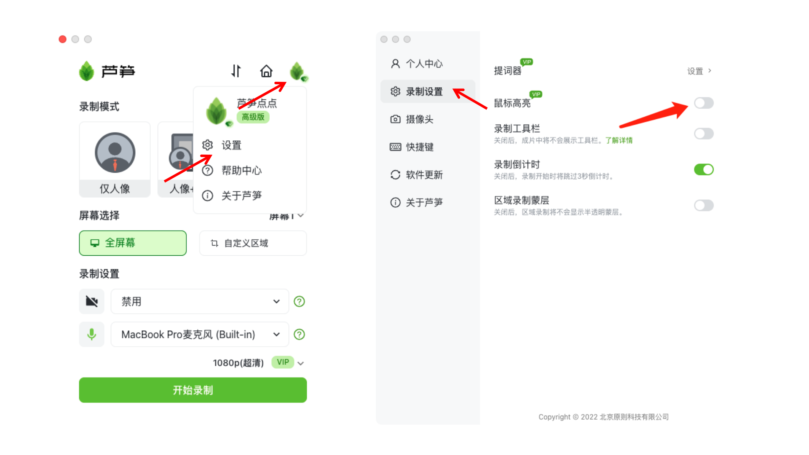
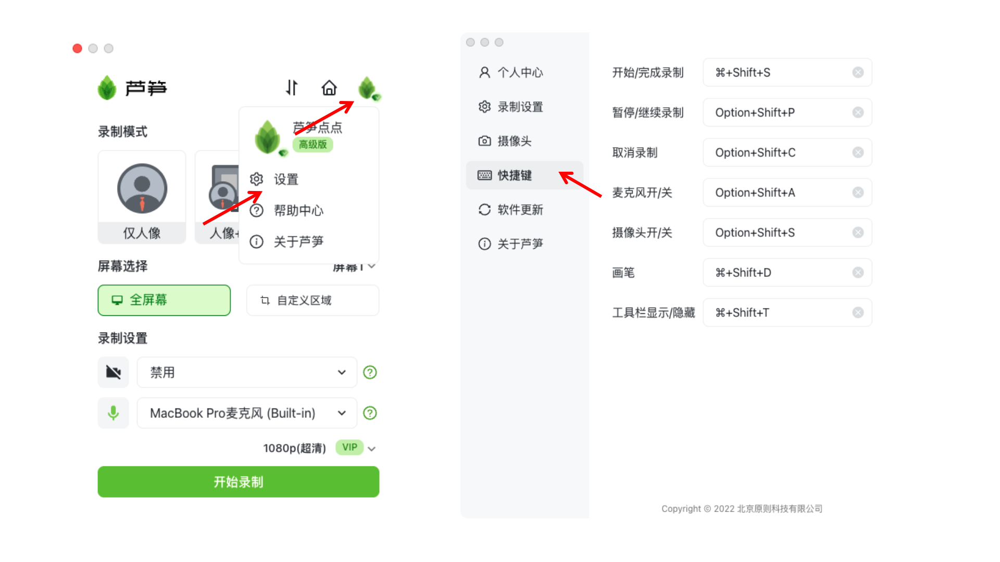

# 美颜等更多设置

你将通过这篇文档了解到如何开启/关闭美颜、鼠标高亮、镜像和快捷键设置等功能。

鼠标高亮、美颜、镜像与快捷键 链接: https://lusun.com/v/bM1biODNMep

### 美颜设置

目前芦笋录屏的电脑端以及安卓手机端，都可以自主开关美颜，iOS还暂时不支持。需要你注意的是，芦笋录屏的美颜当前还不支持参数设置。

#### 电脑端如何开启

你可以通过打开芦笋录屏客户端 - 右上角头像 - 设置 - 录制设置，进行操作

<figure><figcaption>
芦笋录屏电脑端美颜设置
</figcaption></figure>

#### 安卓手机端如何开启

你可以打开芦笋录屏 App - 右下角我的 - 关于芦笋 - 美颜开关，进行操作

<figure><figcaption>
安卓手机开启美颜
</figcaption></figure>

### 鼠标高亮功能 

路径：打开芦笋录屏客户端 - 右上角头像 - 设置 - 录制设置

<figure><figcaption>
芦笋鼠标高亮开关路径
</figcaption></figure>

### 快捷键功能 

路径：打开芦笋录屏客户端 - 右上角头像 - 设置 - 录制设置

<figure><figcaption>
芦笋录屏快捷键设置
</figcaption></figure>

***

推荐更多教程供你参考：[电脑端攻略](../basic/pc.md)｜[手机端攻略](../basic/phone.md)｜[会员特权](../basic/vip.md)｜[进阶教程](./)｜[联系我们](../contact.md)
