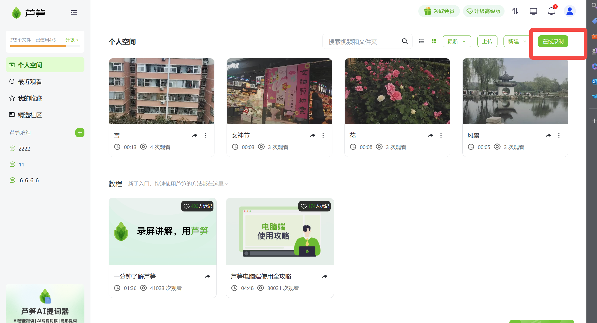
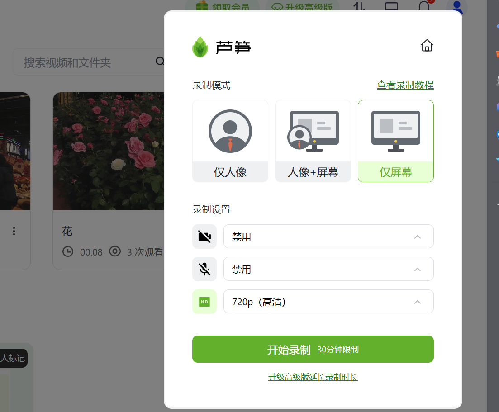
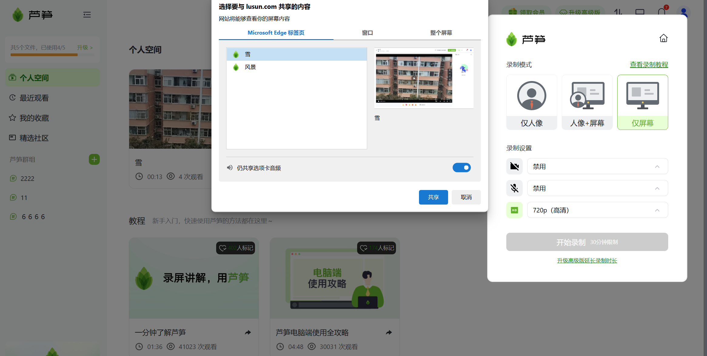
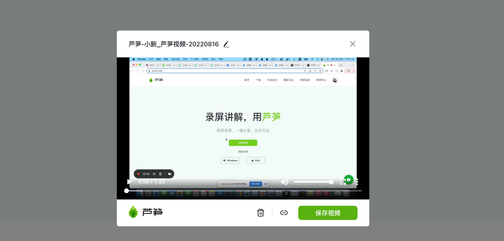

# 在线录制

## 视频教程

在线录制的链接 https://lusun.com/v/iaSXVpfUtw4

## 图文教程

操作方法：

1、打开360浏览器/谷歌浏览器/Edge 浏览器/腾讯浏览器，搜索 [lusun.com](http://lusun.com/?ref=help.lusun.com) 进入芦笋官网

2、点击「个人空间」，点击右上角的「在线录制」，即可召唤芦笋在线录屏功能

<figure><figcaption></figcaption></figure>

## 录制前的模式选择 

1、可以录制人像、屏幕，或者「人像+屏幕」同框视频

2、可以录制麦克风声音、系统声音（ Windows 系统）

3、支持 720P 高清、1080P 超清录制

<figure><figcaption></figcaption></figure>

4、屏幕可以选择指定网页页面即「标签页」、指定软件页面即「窗口」、全屏幕即「整个屏幕」                                                               &#x20;

<figure><figcaption></figcaption></figure>

## 录制工具栏的作用 

* 查看录制时间
* 暂停/继续录制
* 取消录制且不保存视频
* 开关摄像头
* 结束录制

<figure><figcaption></figcaption></figure>

## 录制后的预览页面 

* 快速预览视频效果
* 修改视频名称
* 删除/分享/保存视频到云空间

<figure><figcaption></figcaption></figure>

## 录好的视频存在哪 

* 点击录制面板的「小房子」图标，进入云空间
* 为录制好的视频添加字幕、封面；剪辑视频；生成链接分享视频等

[点我进入云空间](https://lusun.com/dashboard/videos?ref=help.lusun.com)
