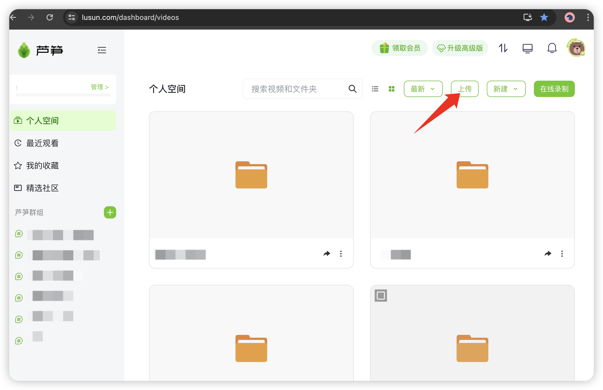
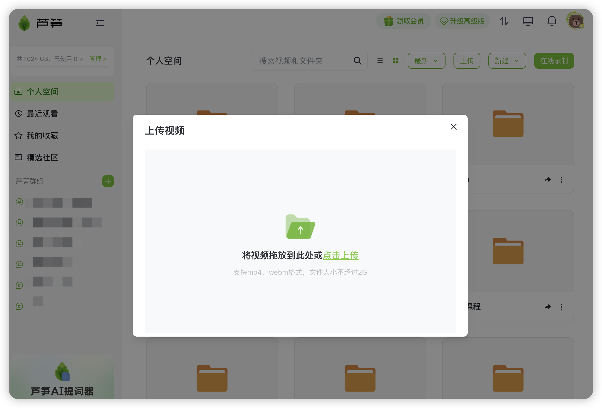
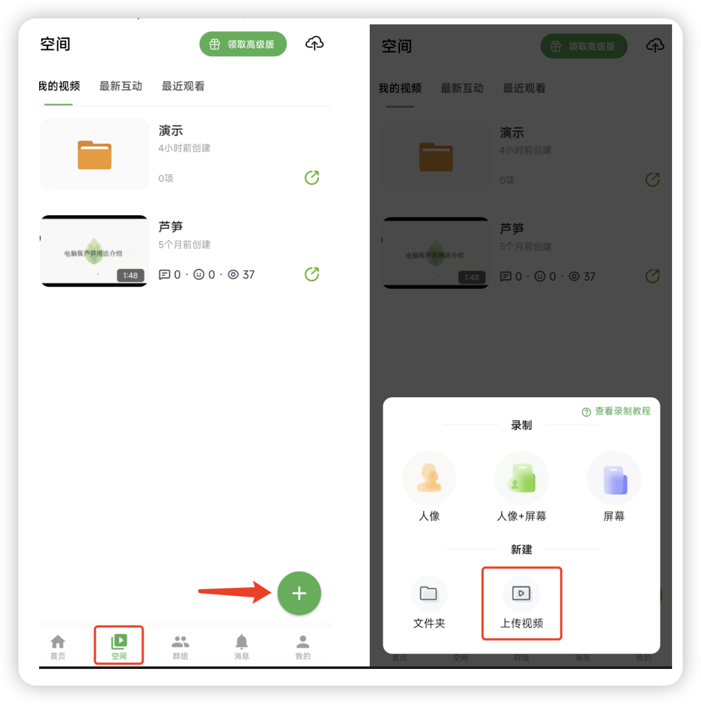

# 上传本地视频到芦笋空间

## 视频教程

如何上传本地视频到芦笋空间 链接: https://lusun.com/v/0ycmmayPeOm

### 电脑端上传 

你可以通过访问 「[芦笋录屏云空间](https://lusun.com/dashboard/videos)」 ，点右上角 「上传」 按钮，需要注意的是，免费版可上传文件大小不超过 300M，高级版可上传文件大小不超过 2G

<figure><figcaption>
电脑端个人空间的上传入口
</figcaption></figure>

<figure><figcaption>
文件上传要求
</figcaption></figure>

### 手机端上传 

你可以打开芦笋录屏APP，点击底部 「空间」 - 「+号」 - 「上传视频」

<figure><figcaption></figcaption></figure>
