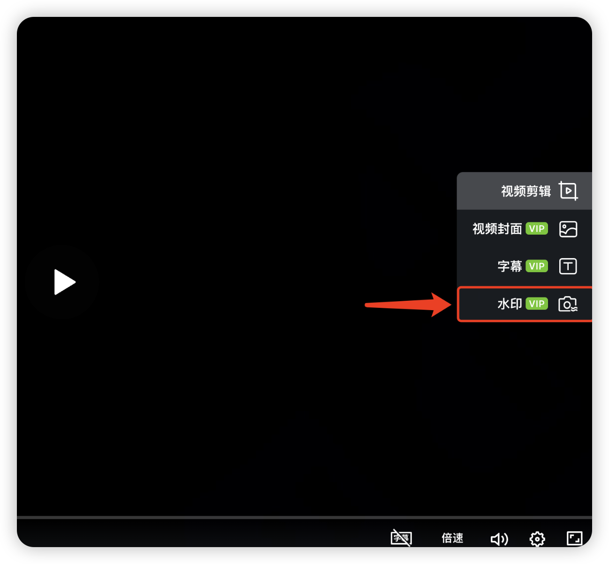
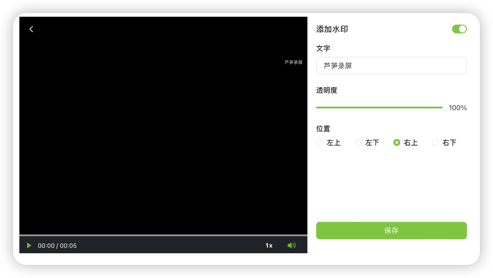

# 自定义水印

## 视频教程 

芦笋录屏自定义水印 链接: https://lusun.com/v/qPSIm6zpnBQ

## 文字教程 

水印作用是什么？可以增加视频所属标识，防止他人盗用视频

### 添加水印入口 

你可以进入 「[芦笋录屏云空间](https://lusun.com/dashboard/videos)」打开视频播放界面，播放器右侧功能栏第 4 个为添加水印

<figure><figcaption>
设置水印的入口
</figcaption></figure>

水印支持自定义设置，你可以操作：文字水印自定义、透明度自定义、位置自定义

<figure><figcaption>
自定义水印
</figcaption></figure>

***

推荐更多教程供你参考：[电脑端攻略](../basic/pc.md)｜[手机端攻略](../basic/phone.md)｜[会员特权](../basic/vip.md)｜[进阶教程](./)｜[联系我们](../contact/)\
