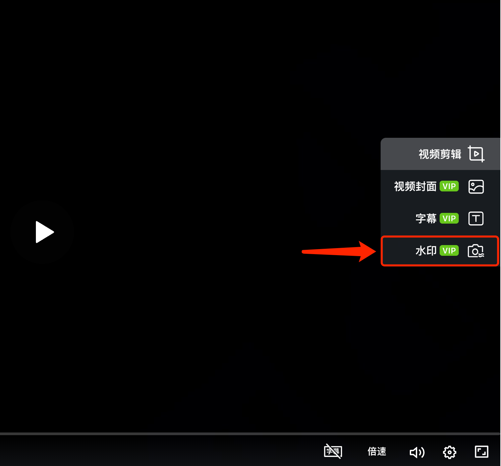

# 自定义水印

## 视频教程

芦笋录屏自定义水印 链接: https://lusun.com/v/qPSIm6zpnBQ

## 图文教程

如果你希望通过添加自定义水印来增加视频所属标识，起到防止他人盗用视频的效果，你可以尝试以下方法添加。

### 添加水印的入口在哪里？

你可以打开电脑上的 「[芦笋云空间](https://lusun.com/dashboard/videos)」，找到需要添加水印的视频，播放器右侧功能栏第 4 个为添加水印

<figure><figcaption>
芦笋录屏添加水印入口
</figcaption></figure>

目前，你可以设置水印的文字，并且可以调整透明度，以及位置

***

推荐阅读：[芦笋录屏欢迎你](../)｜[基础教程](../basic/)｜[进阶教程](./)
