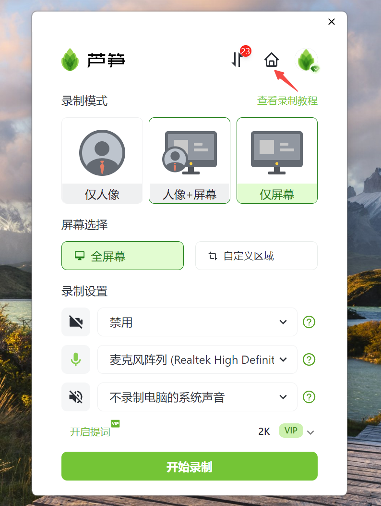

# 字幕教程

## 视频教程

链接：[https://lusun.com/v/CDmkPt85Aa8](https://lusun.com/v/CDmkPt85Aa8)

## 图文教程

1、打开芦笋的客户端，点击上方的小房子图标，可以进入[芦笋云空间](https://lusun.com/dashboard/videos/?ref=help.lusun.com)

<figure><figcaption>
240520_01
</figcaption></figure>

2、点击任意一条视频，进入「 编辑」页面，点击右侧的「 字幕 」

<figure><figcaption>
240520_02
</figcaption></figure>

3、打开「字幕」按钮，就可以智能识别字幕了

<figure><figcaption>
240520_03
</figcaption></figure>

