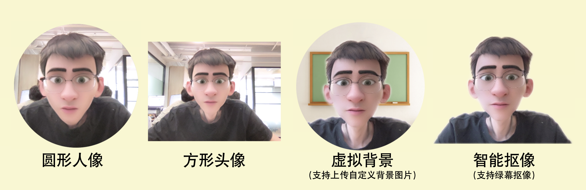

# 电脑端芦笋录屏攻略

## 整体介绍—如何使用电脑录制

[https://lusun.com/v/nrLsJuK8lZJ](https://lusun.com/v/nrLsJuK8lZJ)

## 分步教程 

### 👉芦笋录屏如何下载 

你可以通过以下两种方式，下载使用芦笋录屏的电脑客户端

1. 百度搜索『芦笋官网』
2. 浏览器访问网址 lusun.com

_芦笋录屏如何下载的视频链接_: https://lusun.com/v/Zom2AUGEPbx

### 👉录制详情介绍 

#### 三种录制模式

芦笋录屏提供了【仅人像】、【人像+屏幕】、【仅屏幕】 三种录制模式，下面的简短视频演示了三种模式对应的效果，帮助你快速了解录制的主功能

_芦笋录屏录制前设置链接_: https://lusun.com/v/F7jdJEYKy67

#### 四种人像模式

芦笋录屏提供了 4 种人像模式—【圆形人像、方形头像、虚拟背景、智能抠像】，下面的图片展示了 4 种模式对应的效果预览图

<figure><figcaption>
芦笋录屏录制人像的 4 种样式
</figcaption></figure>

_芦笋录屏的四种人像模式 链接_: https://lusun.com/v/HHZzCyivDIv

#### 绿幕抠像功能

你可以在芦笋录屏使用绿幕抠像功能，实体绿幕会让抠像的效果更精致。可参考以下视频了解详情

_芦笋录屏绿幕抠像功能 链接_: https://lusun.com/v/Ikd1Rw6476i

#### 其它设置项

你可以通过打开芦笋录屏的客户端，点击右上角的头像，里面支持 「设置」 更多，可以设置摄像头、宽高比例、开/关美颜、镜头翻转、鼠标高亮等。

#### 录制中的操作介绍 

你可以通过观看以下视频快速了解录制过程中，如何查看录制时间、暂停 / 继续录制、取消录制、开关音像设置、使用画笔功能等能力。

_芦笋录屏工具栏教程 链接_: https://lusun.com/v/etvxS4eOK06

### 录制后视频存储

### 云空间视频分享

