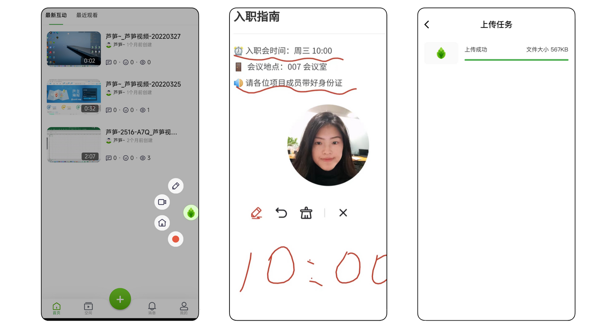

# 手机端芦笋录屏攻略

## 安卓教程

### 安卓视频教程

https://lusun.com/v/KnLIirUaw9b

### 安卓图文教程

#### 👉**录制前的设置**

1. 打开芦笋官网 [lusun.com](https://lusun.com/download?ref=help.lusun.com) 或者软件商城搜索「芦笋」并下载
2. 打开手机设置 - 应用设置 - 应用管理 - 芦笋 - 打开芦笋通知权限 、 允许芦笋悬浮在所有应用最上层👇

<figure><figcaption>
lusun权限设置
</figcaption></figure>

3. 点击「创建视频」下方按钮开始录制，选择「允许芦笋悬浮在所有应用的最上层」以调用录制悬浮球，然后点击「立即开始」👇

<figure><figcaption>
打开 「允许显示在其他应用上层」
</figcaption></figure>

#### 👉录制过程中的操作

1. 打开悬浮球，可以选择画笔、开关摄像头、回到芦笋首页、结束录制
2. 打开想要讲解的画面/课件，使用画笔辅助讲解
3. 点击完成录制，视频自动上传到空间👇

<figure><figcaption>
录制中的示意图
</figcaption></figure>

#### 👉录制后的视频编辑与分享

1. 打开「空间」，对视频修改名称、移动至文件夹方便管理
2. 点击分享一键转发至微信，或复制视频链接并分享
3. 点击视频上方的「高级报表」，查看视频访问数据

<figure><figcaption>
录制后可保存到云空间
</figcaption></figure>

## iOS 教程

### iOS 视频教程

https://lusun.com/v/UDBTH8prKgU

### iOS 图文教程

#### 👉**录制前的设置**

1. 打开 app store 搜索「芦笋」并下载
2. 点击加号开始录制，如果录制「人像」或者「屏幕」模式，选择屏幕方向、是否打开麦克风，点击「开始直播」👇

<figure><figcaption>
iOS 录制人像/屏幕模式
</figcaption></figure>

3. 如果录制 「人像+文件」 模式，需要退出芦笋，从微信、WPS或其他软件 打开 pdf 格式文件，点击右上角三个点 - 使用其他应用打开 - 选择芦笋。然后选择屏幕方向、是否打开麦克风，点击「开始直播」👇

<figure><figcaption>
iOS的人像+文件模式
</figcaption></figure>

#### 👉录制过程中的操作

1. 「人像」或者「屏幕」模式下，你可以随意切换到想要讲解的界面
2. 「人像+文件」模式下，你可以根据个人需要使用画笔辅助讲解
3. 点击屏幕左上角红色键完成录制，你的视频会自动上传到空间👇

<figure><figcaption>
iOS录制后自动上传
</figcaption></figure>

#### 👉录制后的视频编辑与分享

1. 你可以打开「空间」，对视频修改名称、移动至文件夹方便管理
2. 你也可以点击「分享」一键转发至微信，或复制视频链接并分享
3. 你还可以点击视频上方的「高级报表」，查看视频访问数据

<figure><figcaption>
iOS视频分享
</figcaption></figure>


以上就是芦笋录屏手机端的全部介绍了，希望对你有所帮助。


***

推荐更多教程供你参考：[电脑端攻略](pc.md)｜[会员特权](vip.md)｜[进阶教程](../advanced/)｜[常见问题](../faq/)｜[联系我们](../contact/)
