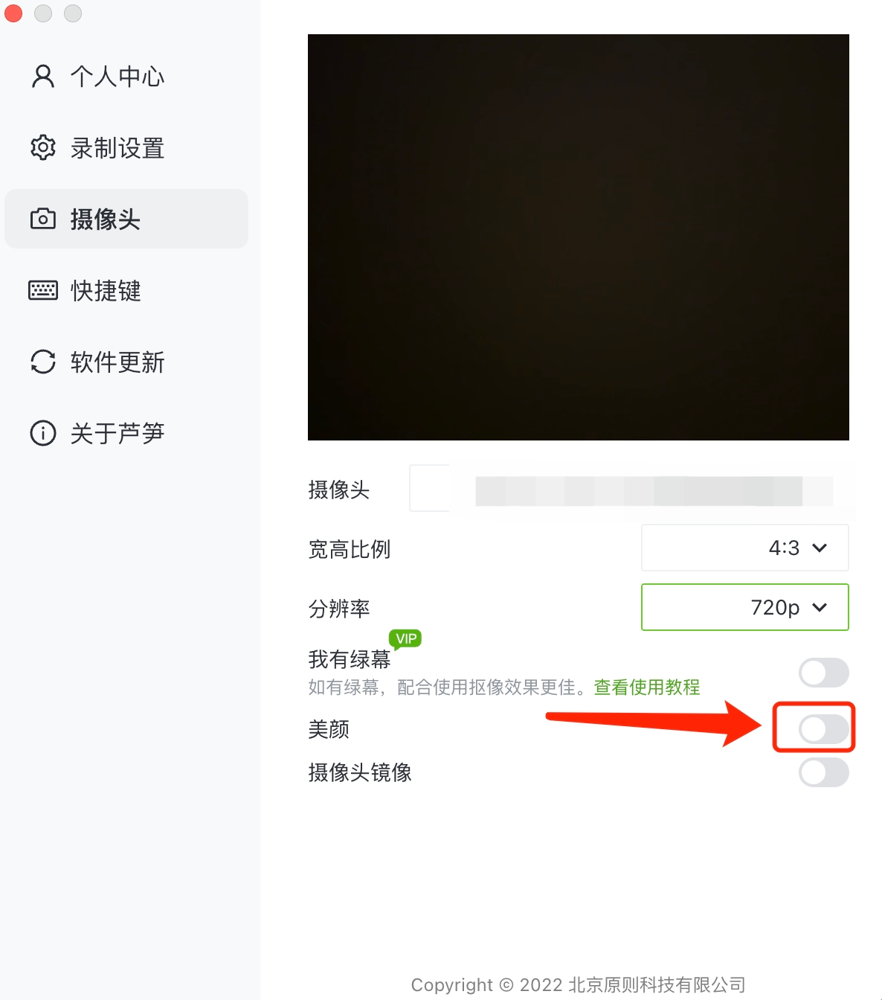

# 录制的视频模糊/卡顿

### 如果录制的视频模糊 

**情况 1**：芦笋免费基础版仅支持 720P分辨率，高级版支持 1080P 和 2K 分辨率，录制效果更加清晰。所以可以先看看检查下自己的账号权益，以及设备的分辨率参数，当你是会员状态，选择了 2K 录制，但如果你的录制设备并不支持 2K 分辨率，那录制的视频将达不到 2K 分辨率

**情况 2**：如果是录制的人像不清晰，可以在芦笋设置中，修改摄像头分辨率。分辨率选择的上限取决于摄像头硬件水平，一般电脑自带的摄像头像素比较低，人像可能会有模糊的情况，推荐使用外接高清摄像头。\
摄像头分辨率调整入口:打开芦笋客户端 - 右上角头像 - 设置 - 摄像头 - 分辨率\

<figure><figcaption>
设置分辨率
</figcaption></figure>

### 如果视频卡顿 

**情况 1**：当你使用 「人像+屏幕」 录制模式时，同时使用美颜、抠像以及虚拟背景等特效功能，对电脑配置要求较高，若录制时出现人像卡顿问题，建议关闭部分特效、降低摄像头分辨率\

美颜功能开关入口：打开芦笋客户端 - 右上角头像 - 设置 - 摄像头 - 美颜\
\
摄像头分辨率调整入口:打开芦笋客户端 - 右上角头像 - 设置 - 摄像头 - 分辨率\

<figure><figcaption>
设置入口，关闭美颜
</figcaption></figure>

\
若以上教程无法解答问题，可以 [联系我们](../contact.md) 帮助解决。
