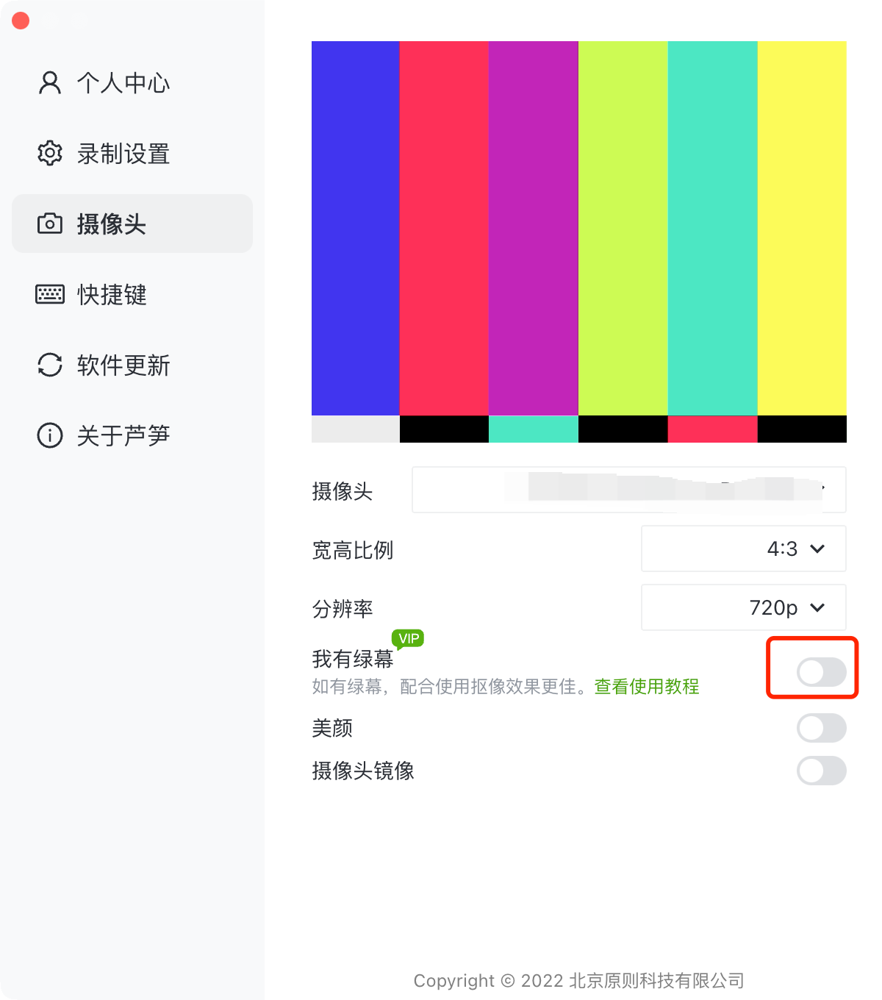

# 虚拟背景/智能抠像无法打开

虚拟背景/智能抠像是高级会员功能，所以放你遇到无法使用时，可以先检查一下当前自己的账号是否是正常的高级会员_（点击查看更多_[_会员权益_](../)_），_如果明确是会员状体，那请可以按照下方指导操作

1. 虚拟背景与智能抠像对电脑系统有较高要求，部分Win7电脑可以尝试修改电脑主题为“Windows 7”，若依旧无法使用，可能是系统版本较低，建议仅开启圆形或方形头像\
   Win7修改主题可以参考：[https://jingyan.baidu.com/article/d169e1865bff5f026611d8cd.html](https://jingyan.baidu.com/article/d169e1865bff5f026611d8cd.html?ref=help.lusun.com)
2. 如果你开启了绿幕抠像，但录制场景没有实体绿幕时，是无法显示抠像效果的。需在在设置中关闭绿幕功能，即可使用虚拟背景与抠像功能\
   关闭路径：打开芦笋 - 右上角头像 - 设置 - 摄像头 - 我有绿幕

<figure><figcaption>
关闭绿幕
</figcaption></figure>

若以上教程无法解答问题，可以 [联系我们](../../contact.md) 帮助解决。
