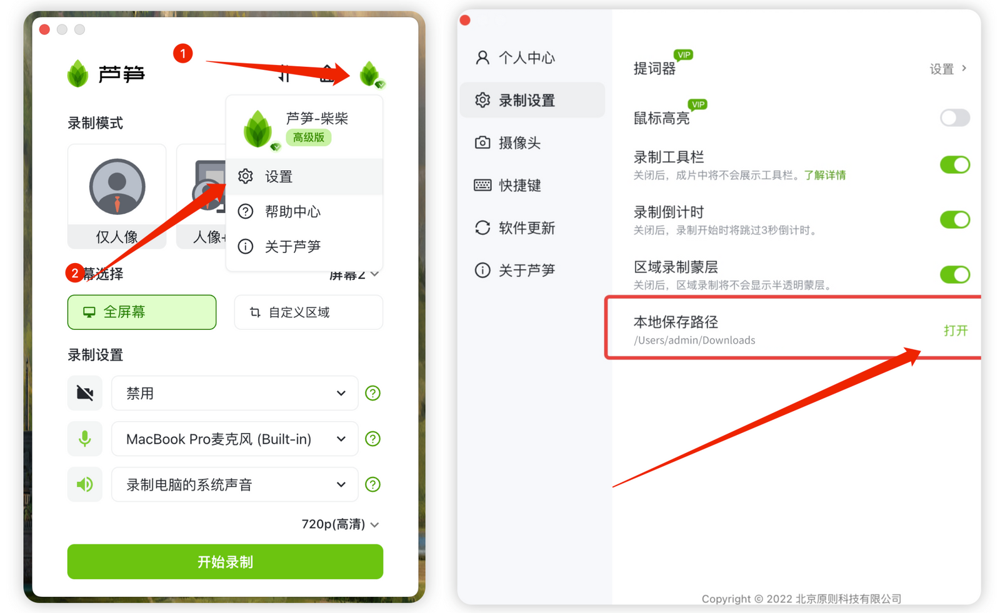
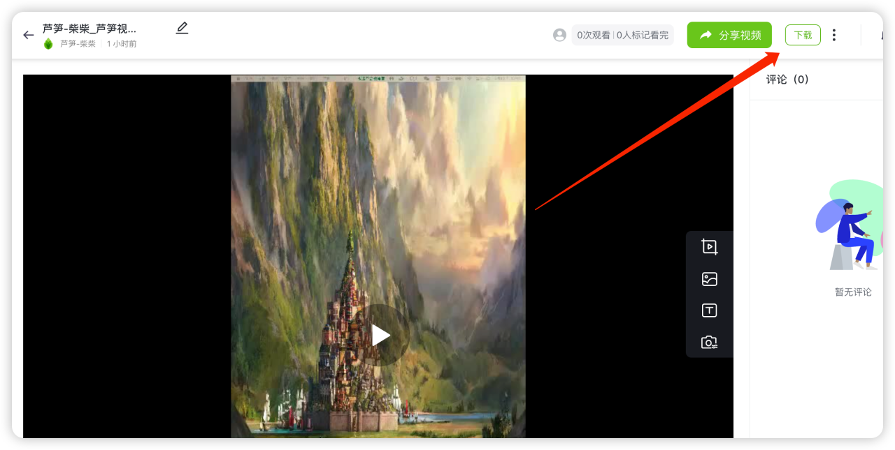

# 视频保存相关

目前使用芦笋录屏录制后，你可以选择将视频保存到本地，也可以保存到自己的芦笋云空间。

## 保存到本地相关问题

#### Q1. 本地的视频保存到哪里了? 

目前你的视频可以选择保存到本地，保存本地的路径支持你自定义，可通过如下方式查询上次视频保存位置：点击录制设置面板右上角头像 →下拉框点击设置→录制设置"本地保存路径"

<figure><figcaption>
该路径为上次视频保存位置，点击"打开"按钮，自动弹出对应文件夹
</figcaption></figure>

#### Q2. 保存到提示本地失败怎么办? 

如果你遇到提示保存本地失败，一般情况下是由于保存路径无法获取系统权限，请尝试：

1. 将保存路径设置为保存到「桌面」
2. 检查并避免保存路径中有中文命名的文件
3. 若上述两种方法无法解决：尝试上传到云空间再下载（如下图所示）

<figure><figcaption></figcaption></figure>

提示保存失败的视频-切换保存地点为："保存至云空间"，然后从「云空间」下载视频

<figure><figcaption>
从云空间，下载对应视频
</figcaption></figure>

#### Q3.我的视频为什么会保存成 webm 格式？ 

如果你遇到部分视频录制时间过长，文过大或者未获取系统权限，这时候如果选择了「本地保存」时，暂时只支持保存为webm格式；若想将视频转化为mp4格式，可使用第三方视频格式转换软件，转换为 mp4 格式。

***

推荐更多教程供你参考：[电脑端攻略](../basic/pc.md)｜[手机端攻略](../basic/phone.md)｜[会员特权](../basic/vip.md)｜[进阶教程](../advanced/)｜[联系我们](../contact/)
