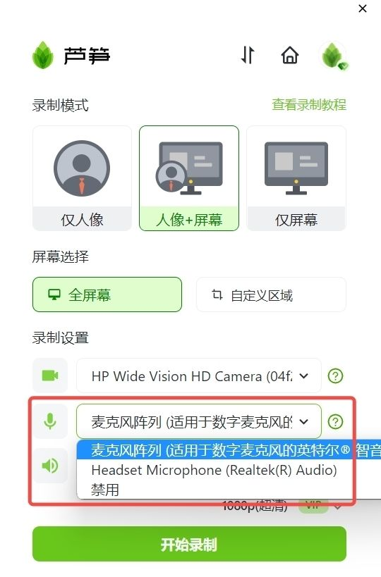
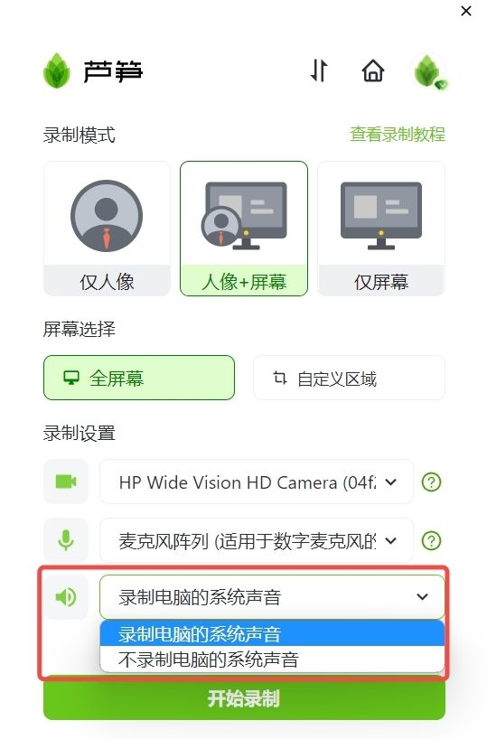
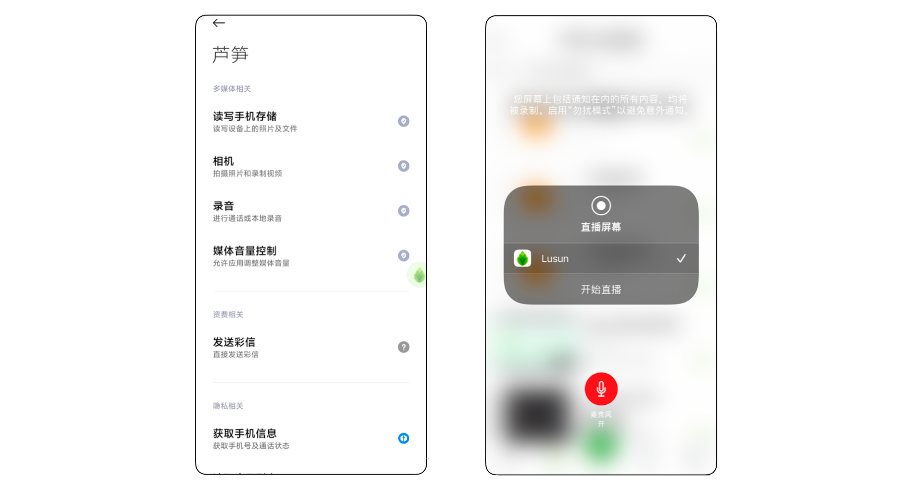

# 录制的视频没有声音

## 👉电脑录制的视频没有声音 

一般会遇到两种情况，一种是麦克风没有声音录入，一种是系统声音录制不上。你可以按以下两类情况进行排查

### 🎤没有麦克风声音 

1. 尝试选择 「麦克风列表」 里的其他选项，进行录制，检测其他麦克风选项是否有声音，建议正式开启录制前，确保麦克风收音正常后再开启录制
2. 若有耳机，可以尝试连接耳机录制，看录制的视频是否有声音
3. 若麦克风的其他选项也没有声音，可以尝试使用电脑微信拨打语音电话，看对方能否听到你说话的声音
4. 若以上方式都未能解决，大概率就是硬件的问题，可以尝试更新摄像头驱动，或找电脑售后维修。\
   1）win7更新驱动：\
   [https://jingyan.baidu.com/article/ab69b2708de4386da7189fb7.html](https://jingyan.baidu.com/article/ab69b2708de4386da7189fb7.html?ref=help.lusun.com)\
   2）win10更新驱动：\
   [https://jingyan.baidu.com/article/7e4409532520076ec0e2eff3.html](https://jingyan.baidu.com/article/7e4409532520076ec0e2eff3.html?ref=help.lusun.com)

<figure><figcaption>
选择其他麦克风
</figcaption></figure>

### ❓没有系统声音 

1. 检查是否开启了录制系统声音选项
2. 部分会议软件（如腾讯会议）有录音限制，无法收录软件内声音，建议调大电脑扬声器音量录制，不要佩戴耳机
3. 苹果电脑录制系统声音，需要安装声卡驱动，详见[Mac教程文档](mac.md)

<figure><figcaption>
Windows 开启录制系统声音
</figcaption></figure>

## 👉手机端录制没有声音 

手机录制视频如果没有声音，一般也是会遇到两种情况，一种是麦克风没有声音录入，一种是系统声音录制不上。你可以按以下两类情况进行排查

### 🎤没有麦克风声音 

1. 手机在录制前，需开启麦克风权限\
   1）安卓设备：打开手机设置 - 应用设置 - 应用管理 - 芦笋 - 允许使用麦克风\
   2）苹果设备:打开芦笋 App - 开始录制前允许芦笋使用麦克风

<figure><figcaption>
手机麦克风权限
</figcaption></figure>

2. 由于手机系统限制原因，同时只能有一个软件调用手机麦克风，若发现视频没有麦克风声音，请检查录制过程中是否有其他软件调用麦克风权限，如：视频通话软件、在线会议软件。

### ❓没有系统声音 

1. 录制前，如需录制手机系统声音，请勾选：录制系统声音
2.  你需要注意的是，录制系统声音对手机版本有要求\
    1）安卓手机系统：安卓10及以上\
    2）苹果手机及iPad：iOS 13及以上

<figure><figcaption></figcaption></figure>

若以上教程无法解答问题，可以 [联系我们](../../contact.md) 帮助解决。
